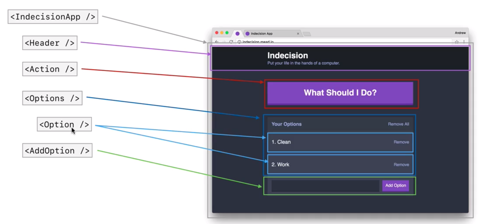

# react-course

### Machine Pre-requistes
```
npm install -g babel-cli
npm install -g live-server
```

### Babel Watch
```
babel src/app.js --out-file=public/scripts/app.js --presets=env,react --watch
```

### Application Schematic
Indecision app broken down into its React Component parts

